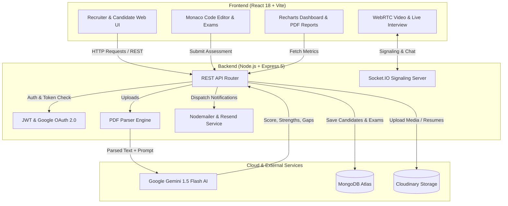

<div align="center">

# 🚀 TalentAI — AI-Powered ATS & Technical Assessment Platform

**An end-to-end modern recruitment pipeline: automated resume parsing, Gemini AI candidate scoring, live WebRTC video interviews, and timed coding assessments.**

[](https://react.dev/)
[](https://vitejs.dev/)
[](https://nodejs.org/)
[](https://expressjs.com/)
[](https://www.mongodb.com/)
[](https://ai.google.dev/)
[](https://socket.io/)
[](https://tailwindcss.com/)

[Live Demo](https://ai-resume-atsp-backend.onrender.com) • [Report Issue](https://github.com/sumancpp/ai-resume-ats/issues) • [LinkedIn](https://www.linkedin.com/)

</div>

---

## 💡 Overview

Recruiting teams frequently spend dozens of hours manually filtering through hundreds of resumes, manually scheduling interviews, and juggling multiple disparate tools for technical assessments.

**TalentAI** unifies the entire hiring journey into a single intelligent platform:
1. **Automated Resume Ingestion & Parsing:** Extracts structured experience, contact details, education, and skill sets from PDF resumes.
2. **Gemini AI ATS Evaluation:** Benchmarks candidate profiles against job requirements with contextual match scoring, skill gap analysis, and personalized interview questions.
3. **Interactive Recruiter Dashboard:** Enables granular search, pipeline folder stages, recruitment analytics, and single-click candidate PDF dossiers.
4. **Live Video Interview Rooms:** Real-time peer-to-peer video interviews powered by WebRTC and Socket.IO.
5. **Timed Technical Assessments:** In-browser coding exam module powered by Monaco Editor with automated time limits and anti-cheat tab-switching detection.
6. **Automated Email Automation:** Automated email delivery for exam invites, video interview links, and application status updates via Resend and Nodemailer.

---

## 🏗️ System Architecture



---

## ✨ Key Features

### 1. 🤖 AI-Powered Resume ATS & Semantic Match
- **Multi-File PDF Upload:** Process resumes seamlessly with Multer and `pdf-parse`.
- **Intelligent Evaluation:** Google Gemini evaluates candidate experience against target roles.
- **Deep Insights:** Computes overall ATS match percentage, highlights verified hard/soft skills, identifies skill gaps, and suggests role-specific technical questions.

### 2. 📊 Recruiter Dashboard & Talent Pipeline
- **Smart Filtering:** Search candidates by keywords, role, minimum ATS score, or experience level.
- **Pipeline Stages:** Move candidates across custom pipeline folders (Applied, Reviewing, Shortlisted, Interviewing, Hired).
- **Recruitment Metrics:** Visual data charts using `Recharts` for applicant score distribution and candidate status.
- **Instant Dossier Generation:** Export high-resolution candidate reports directly to PDF using `html2canvas` and `jsPDF`.

### 3. 🎥 Real-Time Collaborative Video Interviews
- **WebRTC Peer-to-Peer Video:** High-quality, low-latency video and audio calls.
- **Socket.IO Signaling:** Instant room pairing, camera/microphone toggling, and live interviewer notes.
- **In-Call Candidate Evaluation:** Real-time scorecard for interviewer feedback and rating.

### 4. 📝 Interactive Technical Exams & Code Assessment
- **Monaco Code Editor Integration:** Professional coding environment with multi-language syntax highlighting and execution.
- **Curated Questions:** Timed MCQs and coding exercises.
- **Anti-Cheat Proctoring:** Tracks fullscreen compliance, detect window/tab blurs, and records warnings.

### 5. 📧 Transactional Email Automation
- Automatically sends interview invitations, exam links, and status notifications via **Resend** or **Nodemailer SMTP**.

---

## 🛠️ Tech Stack

| Layer | Technology |
|---|---|
| **Frontend** | React 18, Vite, Tailwind CSS v4, Framer Motion, Lucide Icons |
| **Code Editor** | Monaco Editor (`@monaco-editor/react`) |
| **Charts & Reports** | Recharts, html2canvas, jsPDF, react-pdf |
| **Backend** | Node.js, Express 5, RESTful APIs |
| **Database** | MongoDB Atlas, Mongoose ODM |
| **Real-time Engine** | Socket.IO, WebRTC (Native Browser APIs) |
| **AI Engine** | Google Gemini API (`@google/generative-ai`) |
| **Authentication** | JSON Web Tokens (JWT), Google OAuth 2.0 (`google-auth-library`) |
| **Storage & Email** | Cloudinary, Resend API, Nodemailer |

---

## 📁 Repository Structure

```text
ai-resume-ats/
├── Backend/
│   ├── ai/                 # Gemini prompt templates & AI evaluation logic
│   ├── config/             # DB connection, Cloudinary & third-party configs
│   ├── controllers/        # Express request handlers (auth, resume, exam, interview)
│   ├── helpers/            # Reusable utility functions & parsers
│   ├── middleware/         # JWT authentication, file upload & error middlewares
│   ├── models/             # Mongoose schemas (User, Candidate, Exam, Folder)
│   ├── routes/             # Express API routes
│   ├── uploads/            # Temporary upload destination (.gitkeep)
│   ├── utils/              # Email templates & transactional mailers
│   ├── server.js           # Server entry point & Socket.IO initialization
│   ├── .env.example        # Backend environment template
│   └── package.json
│
├── Frontend/
│   ├── public/             # Static public assets
│   ├── src/
│   │   ├── assets/         # Project images & logos
│   │   ├── components/     # UI components (Navbar, Modals, Search, Footer)
│   │   ├── context/        # React context providers (Auth, Socket, Theme)
│   │   ├── pages/          # Application views (Dashboard, CandidateDetails, LiveInterview, TakeExam)
│   │   ├── utils/          # API client helpers & axios instances
│   │   ├── App.jsx         # App router & layout container
│   │   └── main.jsx        # Frontend entry point
│   ├── .env.example        # Frontend environment template
│   ├── vite.config.js
│   └── package.json
│
├── .gitignore              # Root Git ignore rules
└── README.md
```

---

## ⚡ Quick Start Guide

### Prerequisites
- **Node.js**: v18.0 or higher
- **MongoDB**: Local MongoDB instance or free MongoDB Atlas URI
- **Google Gemini API Key**: Obtainable free from [Google AI Studio](https://aistudio.google.com/)

---

### 1. Clone the Repository
```bash
git clone https://github.com/sumancpp/ai-resume-ats.git
cd ai-resume-ats
```

---

### 2. Configure Environment Variables

#### Backend (`Backend/.env`)
Create `Backend/.env` based on `Backend/.env.example`:
```env
PORT=5000
MONGO_URI=mongodb+srv://<username>:<password>@cluster.mongodb.net/<dbname>
JWT_SECRET=your_super_secret_jwt_key
GEMINI_API_KEY=your_gemini_api_key_here
GEMINI_MODEL=gemini-1.5-flash

# Email Configuration
EMAIL_SERVICE=gmail
EMAIL_USER=your_email@gmail.com
EMAIL_PASS=your_gmail_app_password
RESEND_API_KEY=your_resend_key_here
RESEND_FROM="TalentAI ATS <noreply@yourdomain.com>"

# Cloudinary (Optional for cloud storage)
CLOUDINARY_CLOUD_NAME=your_cloud_name
CLOUDINARY_API_KEY=your_cloudinary_key
CLOUDINARY_API_SECRET=your_cloudinary_secret
```

#### Frontend (`Frontend/.env`)
Create `Frontend/.env` based on `Frontend/.env.example`:
```env
VITE_API_URL=http://localhost:5000
VITE_GOOGLE_CLIENT_ID=your_google_client_id.apps.googleusercontent.com
```

---

### 3. Run Locally

#### Start Backend Server:
```bash
cd Backend
npm install
npm run dev
```
*Backend runs on `http://localhost:5000`*

#### Start Frontend Application:
```bash
cd ../Frontend
npm install
npm run dev
```
*Frontend runs on `http://localhost:5173`*

---

## 🔒 Security Best Practices

- All sensitive keys (`MONGO_URI`, `GEMINI_API_KEY`, `JWT_SECRET`, email credentials) must remain in `.env` files and **never be committed to source control**.
- File uploads are validated for MIME type (`application/pdf`) and size limits.
- Endpoints are protected via JSON Web Token verification middleware.

---

## 🤝 Contributing

Contributions, issues, and feature requests are welcome!
1. Fork the Project
2. Create your Feature Branch (`git checkout -b feature/AmazingFeature`)
3. Commit your Changes (`git commit -m 'feat: Add AmazingFeature'`)
4. Push to the Branch (`git push origin feature/AmazingFeature`)
5. Open a Pull Request

---

## 📜 License

Distributed under the **ISC License**. See `LICENSE` for more information.

---

<div align="center">
  Built with ❤️ by <a href="https://github.com/sumancpp">Suman</a>
</div>
